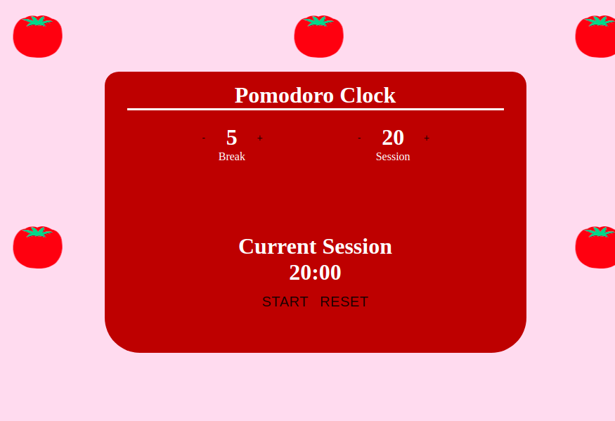

# Pomodoro Clock App

This is a Pomodoro clock I was tasked to build in React during my education at BeCode. It was a learning challenge. The timer is set to a default of 20 minutes for the work session and 5 minutes for the break. But don't worry, you can set the timer and manage your work/break time.

[You can use my Pomodoro Clock here!](https://pomodoro-clock-react.herokuapp.com/)

## Mission

- Learn about React.
- Learn how to think in React.
- Make sure the session time switches to break time when the timer reaches 00:00.
- Make sure when the timer hits 00:00 a alert is played to warn you that it is break time.

## How does the app work

1. Use the plus and minus buttons to increase or decrease the timers.
1. You can pause and restart the clock.
1. You can reset the timer.
1. An alert plays when it is break time.

## What did I learn from this

1. Learning how to use JSX
1. Using components to structure my app.
1. Understanding Class components and Functional components.
1. Understanding data flow and manipulation using States and Props.
1. Importing components to use across my App.

## What was the most challenging

Seeing it was my first time working with a javascript framework, at first I found it hard to understand the concepts of components, states, props and seeing how they all worked together. 

